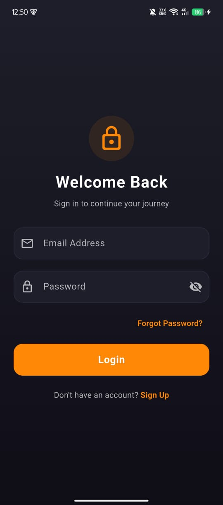
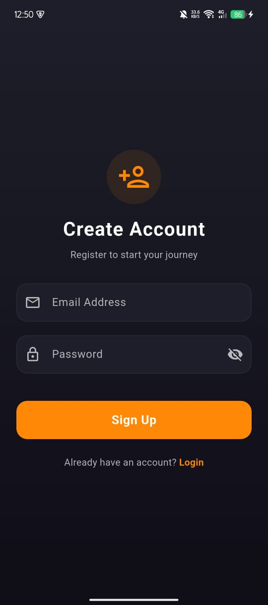
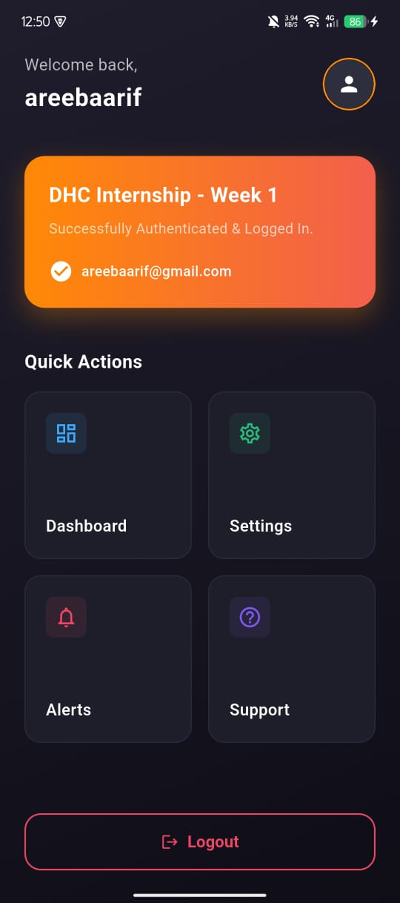

# 🚀 DHC Internship - Week 1: Login & Navigation UI with Firebase Authentication

A premium, modern Flutter application featuring a polished glassmorphic interface, user-side form validations, and real-time backend verification using Firebase Authentication. Designed as part of the **DHC Internship Week 1** curriculum.

---

## 📸 Screenshots

| Login Screen | Registration Screen | Home / Dashboard |
| :---: | :---: | :---: |
|  |  |  |


---

## ✨ Features & Architecture

### 🛡️ Double-Layer Validation System
This application employs a robust **two-layer validation architecture** to ensure maximum reliability and clean UX:
1. **Client-Side Form Validation**:
   - **Email Syntax check**: Validated in real-time using regular expressions (`r'^[\w-\.]+@([\w-]+\.)+[\w-]{2,4}$'`).
   - **Password Requirements**: Validated to ensure password inputs are not empty and are at least 6 characters long during sign-up.
   - **Real-time UX response**: Highlights incorrect input with inline warning borders (`0xFFEF4565` red) and descriptive helper error messages.
2. **Server-Side Firebase Authentication Validation**:
   - **Secure Sign-In & Registration**: Validated in real-time by Firebase Auth backend.
   - **Dynamic Error Handling**: Successfully catches and displays server-side authentication errors:
     - `email-already-in-use` (Checks if an account exists)
     - `weak-password` (Enforces strong passwords)
     - `invalid-credential`/`user-not-found`/`wrong-password` (Handles incorrect credentials securely)
     - `invalid-email` (Sanity checks syntax on server)

### 🎨 Premium Glassmorphic UI Aesthetics
* **Theme**: Sleek dark theme (`0xFF0F0E17` background, `0xFF1E1E2A` card container) with energetic orange accents (`0xFFFF8906`) and responsive inputs.
* **Layouts**: Implemented using modular custom `Column`, `Row`, and animated `Container` components to ensure a premium, modern user interface.
* **Interactive Elements**:
  - Show/hide password toggle.
  - Interactive password reset flow using Firebase (`sendPasswordResetEmail`) with dynamic feedback.
  - Smooth loading indicators during active Firebase authentication.

### 🧭 Navigation & Routing
* Secure navigation to `HomeScreen` only upon successful Firebase Authentication.
* Clean logout routing using standard Flutter Navigation pop.

---

## 🛠️ Tech Stack & Dependencies

* **Frontend**: [Flutter SDK](https://flutter.dev) (v3.0.0+) / Dart
* **Backend Database & Authentication**: [Firebase Auth](https://firebase.google.com/docs/auth)
* **Packages**:
  - `firebase_core`: ^4.11.0
  - `firebase_auth`: ^6.5.3
  - `cupertino_icons`: ^1.0.8

---

## 📁 Repository Directory Structure

```
lib/
├── main.dart                  # Application initialization & centralized dark theme
└── screens/
    ├── login_screen.dart      # Forms, Client-Side Regex + Firebase Auth integration
    └── home_screen.dart       # User Dashboard and session logouts
```

---

## 🚀 Getting Started & Installation

### Prerequisites
* Flutter SDK (3.0.0 or higher) installed and configured on your machine.
* A Flutter-compatible IDE (VS Code, Android Studio, etc.) or a connected physical/virtual device.

### APK Release file

 **APK file is generated**
